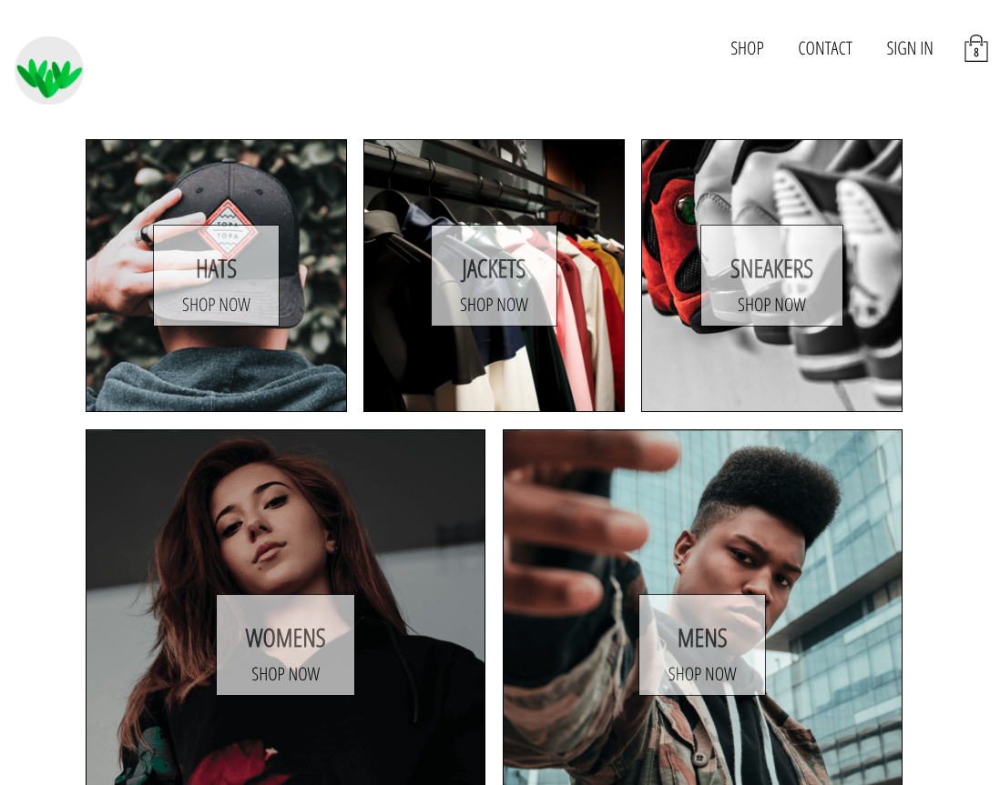
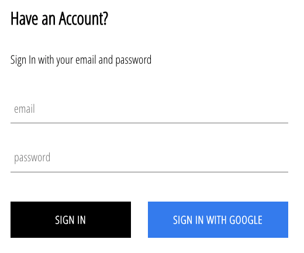
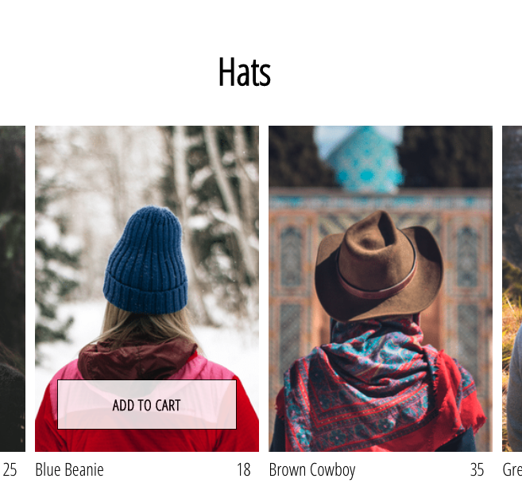

<!-- PROJECT LOGO -->
<br />
<p align="center">
  <a href="https://github.com/Prones94/Market_Store">
    
  </a>

  <h1 align="center">Market</h1>

  <p align="center">
    An e-commerce store using React, Redux, Hooks, Stripe, Firebase, and GraphQL
    <br />
    <a href="https://github.com/Prones94/Market_Store"><strong>Explore the docs »</strong></a>
    <br />
    <br />
    <a href="https://git.heroku.com/floating-eyrie-85770.git">View Demo</a>
    ·
    <a href="https://github.com/Prones94/Market_Store/issues">Report Bug</a>
    ·
    <a href="https://github.com/Prones94/Market_Store/issues">Request Feature</a>
  </p>
</p>


<!-- TABLE OF CONTENTS -->
<details open="open">
  <summary><h2 style="display: inline-block">Table of Contents</h2></summary>
  <ol>
    <li>
      <a href="#about-the-project">About The Project</a>
      <ul>
        <li><a href="#built-with">Built With</a></li>
      </ul>
    </li>
    <li>
      <a href="#getting-started">Getting Started</a>
      <ul>
        <li><a href="#prerequisites">Prerequisites</a></li>
        <li><a href="#installation">Installation</a></li>
      </ul>
    </li>
    <li><a href="#usage">Usage</a></li>
    <li><a href="#roadmap">Roadmap</a></li>
    <li><a href="#contributing">Contributing</a></li>
    <li><a href="#license">License</a></li>
    <li><a href="#contact">Contact</a></li>
    <li><a href="#acknowledgements">Acknowledgements</a></li>
  </ol>
</details>


<!-- ABOUT THE PROJECT -->
## About The Project




Market is an e-commerce web platform, providing a clean and very easy user experience for customers to use. This is intergrated with a test version of Stripe, so it is unable to process real payments. This platform will be using Firebase as a means to authenticate and hold storage.


### Built With

* [React](React)
* [Redux](Redux)
* [GraphQL](GraphQL)
* [SaSS](SASS)
* [Firebase](Firebase)


<!-- GETTING STARTED -->
## Getting Started

To get a local copy up and running follow these simple steps.

### Prerequisites

This is an example of how to list things you need to use the software and how to install them.
* npm
  ```sh
  npm install npm@latest -g
  ```

### Installation

1. Clone the repo
   ```sh
   git clone https://github.com/Prones94/Market_Store.git
   ```
2. Install NPM packages
   ```sh
   npm install
   ```


<!-- USAGE EXAMPLES -->
## Usage



The user can sign in with either their google account or their email. If they need to register, then they can register with their email.
Once signed in, the user can look at different categories based on the type of clothing. Once clicked, the category will show a list of all the items associated with that category type. Users can click on on the item, adding this item to the cart at the top right of the page. The cart can show all the added items and also remove them as well.

<!-- ROADMAP -->
## Roadmap

See the [open issues](https://github.com/Prones94/Market_Store/issues) for a list of proposed features (and known issues).


<!-- CONTRIBUTING -->

<!-- LICENSE -->
## License

Distributed under the MIT License


<!-- CONTACT -->
## Contact

Your Name - Ian Rones

Project Link: [https://github.com/Prones94/Market_Store](https://github.com/Prones94/Market_Store)


<!-- ACKNOWLEDGEMENTS -->
## Acknowledgements

* [](https://github.com/ZhangMYihua) - Yihua Zhang
* []() - Andrei Neagoie

